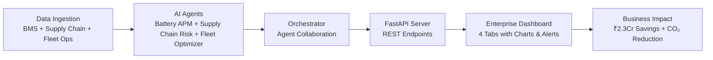

#  Project AURA
## AI Unified Readiness & Analytics for Industrial EV Transition

---

###  Project Overview

**Project AURA** is an AI-powered Enterprise Command Center designed to accelerate India's industrial EV transition. It addresses both the **industrial adoption gap** and the **manufacturing supply chain gap** through a Multi-Agent Intelligence System.

**Built for:** India's 30% EV penetration target for commercial vehicles by 2030.

---

###  Problem Statement

| Challenge | Data |
| :--- | :--- |
| EVs Registered in India (FY2025) | 2+ Million |
| Industrial EV Penetration | < 2.5% |
| India's Import Dependence (Li, Co, Ni) | 100% |
| China's LFP Cathode Control | 98% |
| Target: Commercial EV Penetration by 2030 | 30% |

The barrier is **not financial incentives** — it's **operational intelligence**.

---

###  Solution Architecture

Project AURA consists of **3 AI Agents** + **1 Orchestrator** + **Enterprise Dashboard**:



---

###  AI Agents

| Agent | Function | Key Output |
| :--- | :--- | :--- |
| **Battery APM** | Predicts SoH, RUL, generates maintenance alerts | 100 batteries monitored, 5 alerts |
| **Supply Chain Risk** | Calculates HHI index, flags geopolitical risks | Cobalt HHI: 4,900 (Extreme) |
| **Fleet Optimizer** | Evaluates readiness, recommends EV models | 70% fleet ready, ₹2.3Cr savings |

---

###  Multi-Agent Orchestrator (INNOVATION)

**Agent Collaboration in action:**

1. **Supply Chain Agent** detects Cobalt risk > 70 (DRC instability)
2. **Orchestrator** identifies NMC batteries (cobalt-dependent)
3. **Fleet Optimizer** re-runs with NMC penalty
4. **Recommendation:** Switch NMC → LFP alternatives
5. **Result:** $45,000 supply chain cost avoidance

---

###  Repository Structure

```
Project-AURA-EV-Intelligence/
├── .agents/
│   ├── agents.md
│   └── skills.md
├── data/
│   ├── nasa/          # NASA Battery Dataset (B0005, B0006, B0018)
│   └── supply/        # Supply Chain Data
├── static/            # Generated Charts (PNG)
├── data_loader.py
├── battery_agent.py
├── battery_agent_upgraded.py
├── api.py             # FastAPI Server
├── dashboard.py       # Streamlit Dashboard
├── supply_chain_agent.py
├── fleet_optimizer_agent.py
├── requirements.txt
└── README.md
```

---

###  Getting Started

1. Create a Python virtual environment.
2. Install dependencies: `pip install -r requirements.txt`
3. Run the dashboard: `streamlit run dashboard.py`
4. Run the API server: `uvicorn api:app --reload`

---

###  Notes

This scaffold is intended as the base repository layout and includes placeholder data and agent modules that can be extended for production readiness.
